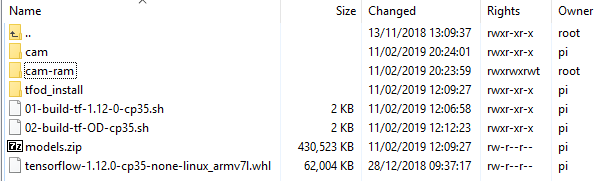

# pi-cam-object-detector
## Installation

A sample SSD Mobilenet graph is provided as an arbitrary working example.
Other SSD Mobilenet graphs are available from:

    https://github.com/tensorflow/models/blob/master/research/object_detection/g3doc/detection_model_zoo.md

    
### Unpack
Unpack the kit into a directory on the pi. 
If this is not "/home/pi" then you will have to make changes to the configuration later.

Make the two shell files executable: `chmod +x *.sh`

### Install Tensorflow and dependencies
The kit requires an appropriate Tensorflow wheel to be downloaded (~62M) alongside the shell files. 
See: https://github.com/lhelontra/tensorflow-on-arm/releases.

If you do not choose "tensorflow-1.12.0-cp35-none-linux_armv7l.whl" then you must correspondingly amend 
the file "01-build-tf-1.12-0-cp35.sh" which has the following line hard-coded:

    sudo pip3 install tensorflow-1.12.0-cp35-none-linux_armv7l.whl

Run `./01-build-tf-1.12-0-cp35.sh' 
This takes about 15 mins on a fast network.

### Install Tensorflow Object Detection and Slim
Run `./02-build-tf-OD-cp35.sh` 
This takes about 30 mins on a fast network.

This script downloads  the full object detection master zip (~500M), and then unpacks it to a directory named "./tfod_install".
It then runs the build and setup to install "object_detection", and then "slim".
Once installed, the zip file and directory can be deleted.

3. Configure a RAM drive on "/home/pi/cam-ram" 

When the property CURRENT_IMAGE_STORE exists and names a directory, 
then the service will write the current image to a file in the directory,
and a detection file if there are detections,
and a boxed image if the property BOXED_IMAGES is True.

Since these files are continually overwritten, if the CURRENT_IMAGE_STORE is on the pi then it should be a RAM drive.

Use `sudo nano /etc/fstab` and add the entry:

    tmpfs /home/pi/cam-ram  tmpfs defaults,noatime,size=5m 0 0

4. Configure the service.

Use `sudo crontab -e` and add the entry:

    * * * * * /home/pi/cam/run-from-cron.sh

The service detects when it is already running, but will regularly try to restart.
The service regularly that *SUSPENDED=0* in the file "service.properties", and if not the service stops.

If *HTTP_SERVER=1* in the file "service.properties" then the service will also start/stop a minimal HTTP file server on CURRENT_IMAGE_PORT.
The file root is obtained from CURRENT_IMAGE_STORE.
Every time the HTTP file server starts, it copies every file from "./site" (i.e. "index.html") into CURRENT_IMAGE_STORE.

5. Run the service.

To start the service manually, run the script:

    start-service.sh

To stop the service manually, run the script:

    stop-service.sh
