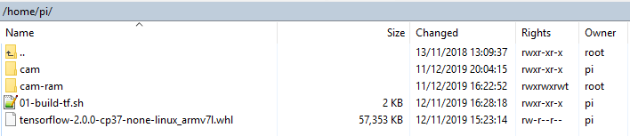

# Installation

Unpack the kit, and open a console, into a directory on the pi. 
If this is not **/home/pi** then you will have to make changes to the configuration later.

Make the two shell files executable: `chmod +x *.sh`

## Install Tensorflow and dependencies

Run `./01-build-tf-1.12-0-cp35.sh`

This takes about 15 mins on a fast network.

The kit requires an appropriate Tensorflow wheel to be **already** downloaded (~62M) alongside the shell files. 
See: https://github.com/lhelontra/tensorflow-on-arm/releases.

If you do not choose **tensorflow-1.12.0-cp35-none-linux_armv7l.whl** then you must 
amend the file **01-build-tf-1.12-0-cp35.sh** correspondingly, since it has the following line hard-coded:

    sudo pip3 install tensorflow-1.12.0-cp35-none-linux_armv7l.whl

## Install Tensorflow Object Detection and Slim

Run `./02-build-tf-OD-cp35.sh` 

This takes about 30 mins on a fast network.

This script downloads the full object detection archive (**models.zip** ~500M), and then unzips it to a directory named **./tfod_install**.
It then runs the build and setup python scripts to install **object_detection**, and then **slim**.

Once installed, the zip file and directory can be deleted.

## Service Configuration

The service is configured by two properties files: **./cam/service.properties** & **./cam/cam.properties**. 

See the comments in each file of these files for specific details, and the readme file in **./cam/** for further information.

In the following sections, names in italic capitals (e.g. *CURRENT_IMAGE_STORE*) refer to keys in the file **./cam/cam.properties**.

### Assign RAM drive on *CURRENT_IMAGE_STORE*

When *CURRENT_IMAGE_STORE* exists and names a directory, 
then the service will write the current image to a file in the directory,
and a detection file if there are detections,
and a boxed image if *BOXED_IMAGES* is True.

Since these files are continually overwritten, if *CURRENT_IMAGE_STORE* is on the pi then it should be a RAM drive.

Use `sudo nano /etc/fstab` and add the entry:

    tmpfs /home/pi/cam-ram  tmpfs defaults,noatime,size=5m 0 0

### Set Cron Job for Resilience 

Use `sudo crontab -e` and add the entry:

    * * * * * /home/pi/cam/run-from-cron.sh

The service detects when it is already running, but will regularly try to restart.
The service regularly checks that **SUSPENDED=0** in the file **./cam/service.properties**, and if not any running service is terminated.

If **HTTP_SERVER=1** in the file **./cam/service.properties** then the service will also start/stop a minimal HTTP file server on *CURRENT_IMAGE_PORT*.

The file root is obtained from *CURRENT_IMAGE_STORE*.

Every time the HTTP file server starts, it copies every file from **./cam/site** (i.e. "index.html") into *CURRENT_IMAGE_STORE*.

