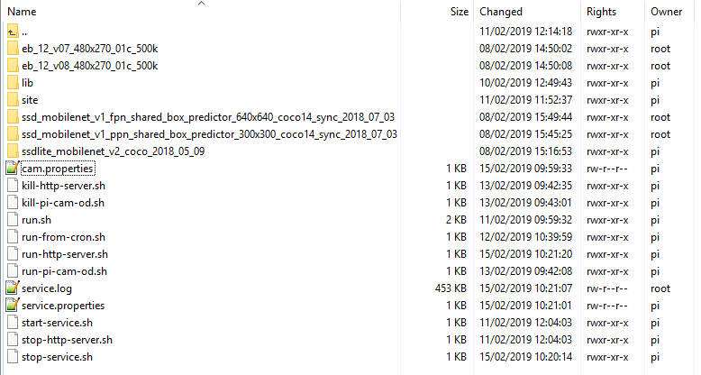

# Commissioning a new node

Unpack the kit, and open a console, into a directory on the pi. 
If this is not **/home/pi** then you will have to make changes to the configuration later.

Make the two shell files executable: `chmod +x *.sh`

**PLEASE NOTE:**
The kit requires an appropriate Tensorflow wheel to be **already** downloaded (~62M) alongside the shell files.<br>
See: https://github.com/lhelontra/tensorflow-on-arm/releases.

If you do not choose **tensorflow-2.0.0-cp37-none-linux_armv7l.whl** then you must 
amend the file **01-build-tf-2.0.0-cp37.sh** correspondingly, since it has the following line hard-coded:

    sudo pip3 tensorflow-2.0.0-cp37-none-linux_armv7l.whl

    

## Install Tensorflow and dependencies

Run `./01-build-tf-2.0.0-cp37.sh`

This takes about 15-30 mins depending on network speed.


## HTTP Server 

When the service is running, you can view the images being taken by pointing a browser at port 8080 on the pi. 
Since the service re-reads it's configuration regularly, most changes to configuration will quickly be visible.


## Service Configuration

The service is configured by two properties files: **./cam/service.properties** & **./cam/cam.properties**. 

See the readme file in **./cam** for further information.

<br>

In the following sections, names in italic capitals (e.g. *CURRENT_IMAGE_STORE*) refer to keys in the file **./cam/cam.properties**.


### Assign RAM drive on *CURRENT_IMAGE_STORE*

When *CURRENT_IMAGE_STORE* exists and names a directory, 
then the service will write the current image to a file in the directory,
and a detection file if there are detections,
and a boxed image if *BOXED_IMAGES* is True.

Since these files are continually overwritten, if *CURRENT_IMAGE_STORE* is on the pi then it should be a RAM drive.

Use `sudo nano /etc/fstab` and add the entry:

    tmpfs /home/pi/cam-ram  tmpfs defaults,noatime,size=5m 0 0


### Set Cron Job for Resilience 

The service is designed to stop when the number of consecutive images **with no detections** exceeds *UNDETECTED_MAX_SEQ* (by default 10000).
You either have to manually restart the service, or set a cron job as follows.

Use `sudo crontab -e` and add the entry:

    * * * * * /home/pi/cam/run-from-cron.sh

The service detects when it is already running, but will regularly try to restart.
The service regularly checks whether **SUSPENDED=1** occurs in **./cam/service.properties**, and if so, any running service is terminated.


### Install a new graph:

Graph files are cached locally within sub-directories in the **./cam/** directory.




To install a new graph:

1. Create a new directory in **./cam/** named for the graph.
    *  The name of the directory is the "graph signature" and is referenced by the GRAPH property in **./cam/cam.properties**.

2. Copy the frozen graph and labels file into the folder.
    *  The frozen graph must have the filename **frozen_inference_graph.pb**.
    *  The labels file must have the name **category_map.js**, of the following format:
```
{
    "blackbird": 1, 
    "blue tit": 2,
    etc...    
}
```
    *  Determine the number of output categories in the graph.

3. Modify **./cam/service.properties** accordingly.
    *  The property GRAPH must refer to the graph directory.
    *  The property GRAPH_NUM_CLASSES must be the number of output categories in the graph.

4. Restart the service
