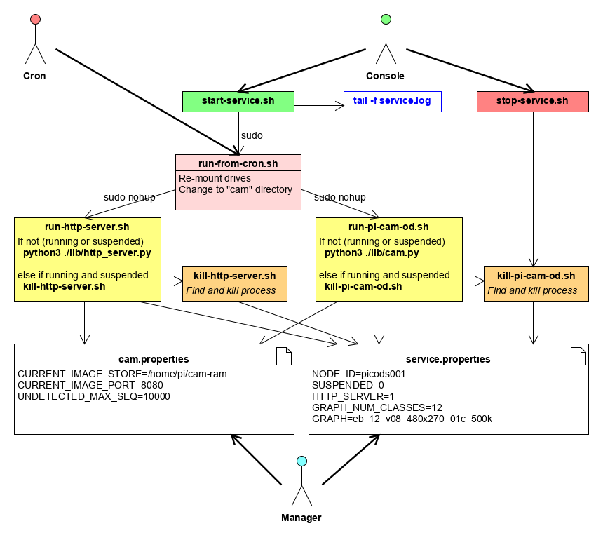

# Overview

In the following sections, names in italic capitals (e.g. *CURRENT_IMAGE_STORE*) refer to keys in the file **./cam.properties**.

The service runs continually unless:

1. The number of consecutive images with no detections exceeds *LOG_UNDETECTED_MAX_SEQ*
2. **SUSPENDED=1** occurs in **./service.properties**
3. The service is otherwise killed

NB: The service will attempt to restart regularly if the cron job is set.

If **HTTP_SERVER=1** occurs in **./service.properties** then a minimal http file server will be started on *CURRENT_IMAGE_PORT* with file root *CURRENT_IMAGE_STORE*.

NB: Because *CURRENT_IMAGE_STORE* is expected to be volatile storage, 
every time the http file server starts, 
it copies every file from **./site** (i.e. "index.html") into *CURRENT_IMAGE_STORE*.

## Flow
The service starts when the **run-from-cron-tab.sh** is executed.

The service first performs the following initialisation sequence:

* read **./service.properties** & **./cam.properties**.
* maybe cache graph and label files if not found locally
* initialize graph
* initialize camera
* initialize current detection frame
* start camera

The service then opens a TensorFlow Session and repeats the following sequence forever, or until interrupted.

* re-read **./service.properties** & **./cam.properties**
* get camera image
* crop detection frame from camera image and submit to graph
* store detection results and related images
* maybe create boxed images
* maybe adjust crop frame - tracking detections

NB: Once the camera is started, its properties are never refreshed; the service has to be restarted to change camera properties.

 
## Customization
The python file **./lib/cam.py** defines four functions with default implementations to be modified as required.

1. A detection filter that returns Tue or False:
 
    `detection_filter( class_name=None, score=None, box=None, frame=None )`

2. A tracking filter that may, or may not, recentre the frame on the target:

    `maybe_move( frame=None, target=None, step=0, max_size=None )`

Given **context** contains raw and frame images, and maybe associated meta-data:

3. An event handler called when there are no detections for an image (after filtering):

    `on_no_objects( context = None )`
    
4. An event handler called when there are detections, responsible for storage:

    `on_detected_objects( context = None )`

    
## Manual Scripts
Start and stop the service manually, by running the scripts:

    start-service.sh
    stop-service.sh

    
## Further Info
* Review the file **./service.properties** & **./cam.properties**, making amendments as required
* Review this information: https://picamera.readthedocs.io/en/release-1.13/fov.html#sensor-modes
* Review the python code in the directory **./lib**
* Review the html file in the directory **./site**

